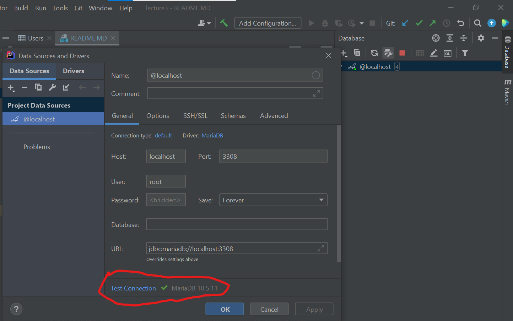

# Lecture 4

## Steg nummer 1:

### Windows:

kjør `startDb.cmd` for å starte database container i Docker.

kjør `build.cmd` for å starte tomcat container i Docker og kompilere prosjektet.

### Mac & Linux:

kjør `startDb.sh` for å starte database container i Docker.

kjør `build.sh` for å starte tomcat container i Docker og kompilere prosjektet.

## Steg nummer 2:

Lag en connection mot databasen via IntellJ:

Etter at du får suksess connection kan du kjøre databaseskriptet som ligger i mappen databaseskript under
navn `createDatabase.sql`.

## Steg nummer 3:

Gå på linken: http://localhost:8081/Lecture-4/ og test de ulike Servletene.

#### NB:

Gjør du en endring i din java kode, kjør build-filen som gjelder din OS på nytt for å kompilere koden på nytt.

Gjør du en endring i din database, trenger du `IKKE` å kjøre build-filen som gjelder din OS på nytt.
